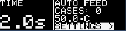
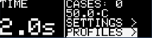
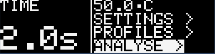
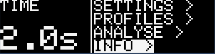
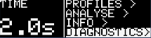
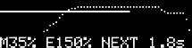
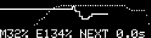
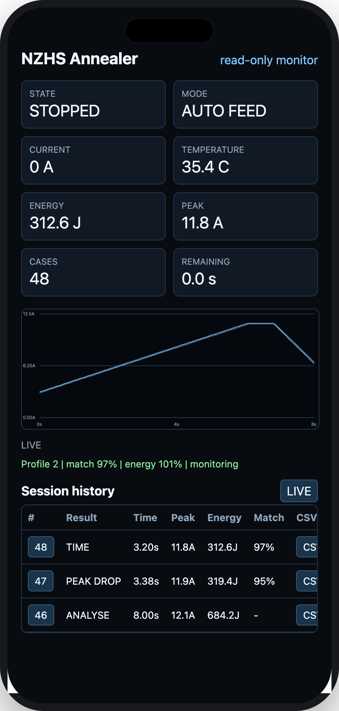
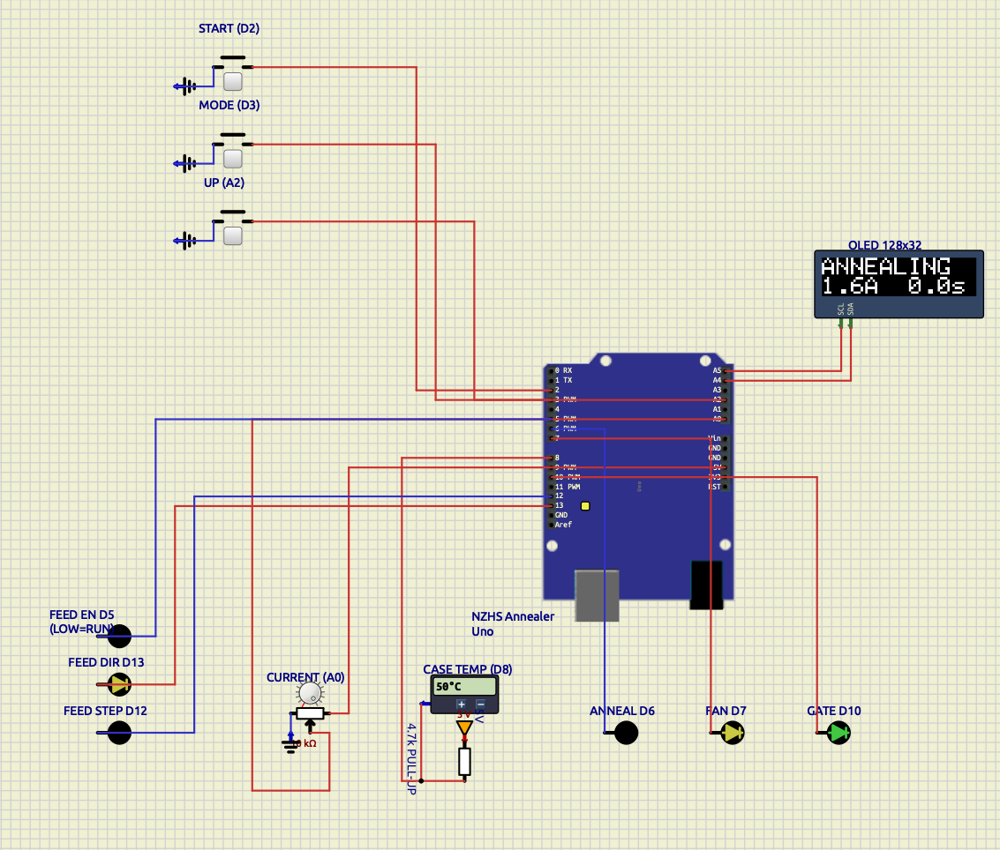

# NZHS Annealer

This is a fork of [MJGNZ/NZHS_ANNEALER](https://github.com/MJGNZ/NZHS_ANNEALER).

Firmware for the NZHS Annealer Shield, supporting Arduino Uno-compatible
ATmega328P boards and the Arduino Uno R4 WiFi from the same sketch. For the
annealer build and hardware guide, see [MGNZ Makes](http://www.mgnz-makes.com/).

This branch is firmware version **4.2.0**. Test changes with the machine
attended before relying on automatic operation. Menu changes can be safely
tested with the included Uno R3 [SimulIDE simulation](simulide/).

## Controls

| Button | Normal stopped screen | Menus |
| --- | --- | --- |
| START | Start the selected run mode |
| MODE | Move through the home-screen selections | Move the selection or scroll information |
| UP | Change the selected time/mode, or open the selected item | Change, confirm, or enter the selected item |

The OLED screen retains its original layout: anneal time on the left;
fan state, operating mode, case count, and temperature on the right.

Press MODE to move through `TIME`, `MODE`, `SETTINGS`, `PROFILES`, `ANALYSE`,
`INFO`, and `DIAGNOSTICS`; press UP to open the highlighted menu. After a normal
current graph has been captured, `REVIEW >` appears directly after `MODE` and
before `SETTINGS`. Representative home screens are shown below.

| TIME | MODE | SETTINGS | PROFILES |
| --- | --- | --- | --- |
|  |  |  |  |

| ANALYSE | INFO | DIAGNOSTICS |
| --- | --- | --- |
|  |  |  |

### Time adjustment

With TIME selected, UP normally adds 0.1 seconds and wraps from 8.0 to 2.0
seconds. After five UP presses no more than one second apart, it adds 0.5
seconds instead. Pause for more than one second to return to 0.1-second steps.
Holding UP resets the time to 2.0 seconds.

## Running cases

Select a mode, then press START.

- **Single-shot** anneals and drops one case, then stops.
- **Free-run** anneals and drops a case, shows a five-second `LOAD` countdown,
  then starts the next cycle. Load each case manually.
- **Auto-feed** operates the stepper feeder between cycles.

A current sensor is strongly recommended for free-run and auto-feed, and is
required for the firmware's under-current and over-current safety features.
Do not use unattended automatic operation without one.

On first use after power-up, START first displays the existing case-height/time
warning. Press START again to acknowledge it, then START once more to begin a
run.

## Settings

Open `SETTINGS >` with UP. MODE selects `RESTART`, `DUMP`, or `BACK >`; UP
changes the selected item.


- **RESTART** resumes free-run or auto-feed after a cooldown. It is saved in
  EEPROM.
- **DUMP** forces free-run and disables the feeder. In DUMP mode you can hold
  MODE to open the drop gate and release it to close the drop gate.

RESTART and DUMP are mutually exclusive: enabling one turns the other off.
Changing operating mode also turns DUMP off.

The gate still opens automatically at the end of every anneal cycle. DUMP adds
a manual gate override; it does not remove the normal drop sequence.

## Cooldown and faults

With a temperature sensor fitted, cooldown begins above 55 C and a run may
resume below 40 C.

- With RESTART enabled, free-run and auto-feed resume automatically after
  cooldown. Single-shot does not.
- START during cooldown cancels the pending restart and returns to the stopped
  screen. `COOL!` remains beside the temperature and prevents another run until
  the temperature is below 40 C.
- If a sensor detected at boot later returns an invalid reading, annealing stops,
  the fan stays on, and `TEMP ERROR` is displayed. Restore a valid reading and
  press MODE to clear it.
- If no temperature sensor is detected at boot, operation follows upstream
  v3.8.0 behaviour: temperature display, cooldown, and thermal protection are
  unavailable.
- With a current sensor detected, the low-current safety check ignores the
  first anneal cycle. From the second cycle, an average current at or below
  0.1 A indicates no usable annealing current: it stops before the gate opens
  and displays `CHECK CASE` / `CURRENT LO!`.
- After one ignored cycle and five normal cycles, the firmware also stops when
  a cycle falls below 85% of the learned moving current baseline.

The current checks help detect an empty coil or missing cases. They cannot
detect every mechanical jam.

## Cartridge profiles

`PROFILES >` stores up to eight named profiles in EEPROM. Each profile saves:

- Anneal time
- Operating mode
- RESTART setting
- DUMP setting
- TIME, estimated ENERGY, or PEAK DROP stop rule
- An optional 64-sample Analyse reference curve

MODE selects a profile or action; UP opens or confirms it. Empty slots are
shown as `PROFILE 1` through `PROFILE 8`. A profile name has ten characters;
hold UP for one second while editing the profile name to cycle characters
automatically. Loading a profile applies its settings immediately. The learned
current baseline is per-run and is not saved in a profile.

Firmware 4.2.0 uses a new profile/reference format for estimated-energy
semantics. Profiles created by earlier builds are intentionally invalidated;
recreate their names, settings and Analyse references after upgrading. Global
RESTART/DUMP settings and R4 WiFi credentials are unaffected.

Opening a profile defaults to `LOAD >`; `SAVE`, `RENAME`, and confirmed
`DELETE` operations display a brief acknowledgement. `REFERENCE >` shows only
the profile's saved Analyse reference, peak current and estimated energy. Actual
normal-case graphs are reviewed consistently through the home `REVIEW >`
item.

| Profile selector | LOAD action |
| --- | --- |
|  |  |

## Analyse mode

`ANALYSE >` records the annealer's current profile over a fixed eight-second
run. It is intended for attended testing with sacrificial cases while working
out the current and energy profile for a new case type. An analysis run may
overheat and ruin the case; it is not a normal annealing cycle.

| Load prompt | Analyse menu |
| --- | --- |
|  |  |

A current sensor is required. Select `ANALYSE >`, load a case when prompted,
then press START. During the run the firmware:

- Targets one current sample every 25 ms.
- Draws the current trace across the 128-pixel OLED. The horizontal scale is
  zero to eight seconds and the vertical scale is zero to 12.5 A.
- Shows the running current and an `~J` energy estimate calculated at 80% of
  measured electrical input energy.
- Sends each sample to the USB serial port at 115200 baud for external logging
  and graphing.
- Retains the latest graph, peak current, raw input energy and 80% estimate in
  RAM so the result can be reviewed or configured before it is saved.
- Turns the annealing output off after eight seconds, opens the drop gate for
  five seconds, then shows the completed graph with `BACK >`.

After one result has been retained, opening Analyse shows `NEW >`, `REVIEW >`,
`CONFIG >`, and `BACK >`. CONFIG selects a TIME, estimated ENERGY, or PEAK DROP
stop rule, its target or maximum time, and the destination profile. An ENERGY
target is the same 80% estimate shown as `~J` on the graph. Saving writes a
64-sample reference plus peak current, estimated energy, duration, and checksum
to that profile. The Analyse working copy is then cleared so the saved curve is
reviewed through the profile's `REFERENCE >` action instead of appearing in two
menus.

Loading a profile with a saved reference compares subsequent normal cases with
that curve. During annealing the dotted reference and solid current-case trace
are shown together. The completed comparison remains visible during the normal
drop and, in auto-feed mode, during the existing reload countdown without
adding delays. The footer shows values such as `M94% E103% NEXT 1.8s`; the
latest normal case remains available under `REVIEW >` until another normal
case or Analyse capture replaces it. Match results are observational: the selected TIME,
ENERGY, or PEAK DROP rule still determines when annealing stops.

| Auto-feed reload | Countdown completion |
| --- | --- |
|  |  |

Every normal run with a detected current sensor captures its current graph,
including one-shot and free-run cases without a profile reference. `REVIEW >`
then appears above `SETTINGS` and shows the latest trace with peak current and
estimated `~J`; a loaded reference is overlaid as a dotted line. The buffer is
session-only and is replaced by the next normal case or Analyse capture.

Holding MODE for at least 300 ms during an analysis is the manual safety abort.
It immediately turns the annealing output off and opens the drop gate for five
seconds. The 12.3 A over-current cutoff remains active throughout the run.
Analysis cannot start while cooldown is active or while the last valid
temperature reading is above 55 C. Temperature conversion is paused during the
eight-second run to avoid disrupting the 25 ms current-sampling interval.

Serial output uses records of the following form:

```text
ANALYSE,START
ANALYSE,SAMPLE,t_ms=25,current_ma=6500,input_energy_J=7.556
ANALYSE,END,t_ms=8000,input_energy_J=400.000,estimated_energy_J=320.000,efficiency_pct=80,peak_ma=12000
ANALYSE,GATE_OPEN
```

Raw input energy is calculated from measured current, elapsed time, and the
single configured 46.5 V supply value. Analyse and normal profile ENERGY stops
use the same elapsed-time integration, so changing
`ANALYSIS_SUPPLY_VOLTAGE_MV` updates every energy calculation. The OLED, ENERGY
profiles and primary browser value show 80% of that input as a deliberately
approximate `~J` value. The factor represents assumed ZVS efficiency; it does
not measure case temperature or account for variable coupling, coil heating and
other losses. Serial retains raw input and estimated energy; JSON and CSV also
report the configured voltage for technical analysis.

## Information and diagnostics

`INFO >` shows the current-safety threshold (85% of the learned baseline for
current during annealing), the learned baseline current from the last normal
cases, the estimated Uno 5V rail, and the firmware version. MODE scrolls
through these values; UP returns to the stopped screen.

`DIAGNOSTICS >` shows temperature-sensor/current-sensor status and `RST:c|s`,
a best-effort reset record: `c` is the reset cause and `s` is the state
recorded before the reset. UP returns to the stopped screen.

| Record | Values |
| --- | --- |
| `c` cause | `W` watchdog; `B` brown-out; `E` external reset; `P` power-on; `-` unavailable |
| `s` state | `A` annealing; `D` dropping; `R` reloading; `C` cooldown; `S` stopped; `?` unknown |

The record is best-effort because the Uno bootloader can clear the reset cause
before the firmware reads it.

| INFO thresholds | INFO voltage/version | Diagnostics |
| --- | --- | --- |
|  |  |  |

## Build and upload

### Arduino IDE

| Dependency | Uno R3-compatible AVR | Uno R4 WiFi |
| --- | --- | --- |
| Board package | Arduino AVR Boards 1.8.8 | Arduino UNO R4 Boards 1.6.0 |
| OneWire 2.3.8 | Required | Required |
| DallasTemperature 4.0.6 | Required | Required |
| Servo 1.3.0 | Not required | Required |
| SPI, Wire, EEPROM | Included with board package | Included with board package |
| FspTimer | Not used | Included with R4 board package |
| Arduino_LED_Matrix | Not available | Included; optional bench debug only |
| WiFiS3 | Not available | Included; optional read-only monitor |

Adafruit GFX and SSD1306 are not required; the firmware contains its own
fixed-size OLED renderer. The Uno R4 board package supplies FspTimer,
Arduino_LED_Matrix and WiFiS3; they do not need separate Library Manager
installs.

1. Install the current [Arduino IDE](https://www.arduino.cc/en/software).
2. In **Library Manager**, install OneWire and DallasTemperature. Install Servo
   only when building for the Uno R4.
3. For an Uno R4, install **Arduino UNO R4 Boards** 1.6.0 in Boards Manager.
4. Open [`NZHS_ANNEALER_128x32_OLED.ino`](NZHS_ANNEALER_128x32_OLED/NZHS_ANNEALER_128x32_OLED.ino).
5. Select the board currently being used:
   - **Arduino AVR Boards → Arduino Uno** for Uno R3-compatible AVR boards; or
   - **Arduino UNO R4 Boards → Arduino UNO R4 WiFi** for the R4 WiFi.
6. Select its serial port under **Tools → Port**, then use **Verify** or
   **Upload**. The sketch selects the correct hardware backend automatically;
   no separate sketch or build script is required.

Only flash the firmware while the unit is idle, not annealing or in cooldown.

### Arduino CLI

From the repository root:

```sh
arduino-cli compile --fqbn arduino:avr:uno --export-binaries NZHS_ANNEALER_128x32_OLED
arduino-cli compile --fqbn arduino:renesas_uno:unor4wifi --export-binaries NZHS_ANNEALER_128x32_OLED
```

The tracked release artifacts are:

- `NZHS_ANNEALER_128x32_OLED.ino.standard.hex` — standard Uno image
- `NZHS_ANNEALER_128x32_OLED.ino.with_bootloader.standard.hex` — image that
  includes the bootloader
- `NZHS_ANNEALER_128x32_OLED.ino.uno-r4-wifi.bin` — Uno R4 WiFi application
  image; its board bootloader remains separate

When firmware source changes, rebuild all tracked artifacts from the exact commit
before distributing or pushing them.

The Uno R4 core embeds its absolute build path in the application image. CI and
local release builds therefore use `/tmp/nzhs-firmware-ci/r4-wifi` as the
canonical R4 WiFi build path before comparing or replacing the tracked BIN:

```sh
arduino-cli compile --clean \
  --fqbn arduino:renesas_uno:unor4wifi \
  --build-path /tmp/nzhs-firmware-ci/r4-wifi \
  NZHS_ANNEALER_128x32_OLED
```

Using another path can produce a functionally equivalent but byte-different
R4 BIN, which will deliberately fail the firmware CI artifact check.

## Uno R3 and R4 support

[`AnnealerPlatform.h`](NZHS_ANNEALER_128x32_OLED/AnnealerPlatform.h) selects an
ATmega328P or Renesas RA4M1 backend at compile time. The R3 retains its original
Timer1 servo output, Timer2 feeder interrupt, AVR watchdog, reset diagnostics,
ADC rail measurement, and byte-oriented EEPROM writes. The R4 backend uses the
Servo library, a Renesas `FspTimer` callback, the RA4M1 watchdog and reset
registers, the R4 ADC API, and batched virtual-EEPROM writes.

Both targets use the same shield pins, core menus, profile format and safety
rules. The R4 WiFi adds its own Settings and Info rows and stores WiFi data in
the otherwise-unused EEPROM tail from address 768; profile/reference storage
still ends before that address. R4-only code is excluded from the R3 build, and
the R3 firmware remains constrained by its 32 KB flash limit.

The R4 build compiles successfully, but installation on the annealer remains
hardware-validation work. Before energising the coil, verify the safe boot pin
states, D9 gate-servo pulse widths, D12 feeder step rate, D13 direction and D5
enable behaviour, A0 current calibration, DS18B20 operation on D8, watchdog
reset recovery, EEPROM persistence, and every fault/cooldown path. The current
SimulIDE harness models the Uno R3 and does not validate the Renesas timer or
watchdog backend.

### Uno R4 WiFi matrix bench diagnostics

The R4 WiFi's 12x8 LED matrix is obscured by the installed annealer shield, so
the production firmware leaves it completely uninitialised during normal use.
For bare-board development, send `M` at 115200 baud while stopped to enter a
non-persistent, run-blocking diagnostic mode. It shows platform, reset, output,
sensor, temperature and heartbeat pages while printing full values over Serial.
Resetting exits diagnostics. See
[Uno R4 WiFi matrix bench diagnostics](docs/R4_MATRIX_DEBUG.md) for the page
legend, DS18B20 wiring, safety behaviour and troubleshooting.

### Experimental Uno R4 WiFi monitor

The R4 WiFi build contains an opt-in, read-only browser monitor. Open
`SETTINGS >`, select `WIFI >`, then use `SETUP >` to start the temporary open
`NZHS-Annealer-Setup` access point. Browse to `http://192.168.4.1`, enter the
normal LAN credentials, and the annealer will join that network. The final Info
rows show connection state and IP address. `MONITOR: ON/OFF` controls whether
the saved network is used after reset.

The page shows operating state, current, temperature, estimated energy, peak
current, case count, time remaining, and live or retained current/reference curves. If
the saved network cannot be reached within 15 seconds, the setup access point
returns so the credentials can be corrected. Credentials are stored
unencrypted in the R4 EEPROM-backed storage.

The dashboard serves an MGNZ-derived favicon, 180 px Apple touch icon and web
app manifest, allowing it to be saved as an iOS/Android Home Screen shortcut.
It also retains the latest 16 current traces in R4 RAM for browser review and
per-result CSV download. The history clears on reset and causes no EEPROM wear.

<p align="center">
  
</p>

The monitor deliberately has no remote START, gate, feeder, profile-write,
upload, or firmware-update controls. Sending `W` at 115200 baud while stopped
still starts the non-persistent direct `NZHS-Annealer` monitor AP for bench
work; sending `S` starts the persistent setup AP on a bare R4 without the
OLED/buttons, `I` prints the current WiFi state/IP, and `B` toggles raw button
transition reporting over USB. The OLED
`RESET >` confirmation or Serial `X` erases saved credentials and
disables monitoring. Matrix diagnostics may run alongside the read-only WiFi
monitor, but continue to force the annealer off and block START. See the
[R4 WiFi monitor guide](docs/R4_WIFI_MONITOR.md).

## Simulator

The [`simulide/`](simulide/) harness uses SimulIDE 1.1.0 SR2 on macOS (as
tested, but should work on Windows/Linux) and loads the normal production HEX;
it is not a simulator-specific firmware build.
See [simulide/README.md](simulide/README.md) for setup and limits.

SimulIDE 1.1.0 supports the AVR-based Uno R3 model, not the Renesas RA4M1 in
the Uno R4. SimulIDE 2's 32-bit/QEMU work is experimental and does not provide
a usable RA4M1 or combined RA4M1/ESP32-S3 Uno R4 WiFi model. The harness can
therefore validate the shared menus and R3 state-machine behaviour, but R4
timers, servo pulses, watchdog, ADC and virtual EEPROM require physical-board
testing. See the [SimulIDE MCU list](https://simulide.com/p/mcus/) and its
[32-bit MCU status](https://simulide.com/p/forum/topic/how-to-add-apm32-mcu-to-simuiide/).



## Testing and development notes

The detailed release/hardware validation checklist is in
[docs/TESTING.md](docs/TESTING.md).
The tagged-release, checksum and provenance procedure is in
[docs/RELEASING.md](docs/RELEASING.md).

## Version history

SW version 4.2.0

- Unified the displayed release version across Uno R3, R4 Minima and R4 WiFi.
- Changed user-facing ENERGY values and targets to an 80%-efficiency estimate,
  displayed as `~J`, while retaining raw input energy in technical outputs.
- Centralised Analyse and profile ENERGY integration on the configured 46.5 V
  supply value instead of an implicit 48 V stop-rule factor.
- Invalidated profiles and Analyse references saved by earlier firmware so raw
  and estimated ENERGY targets cannot be confused.
- Added universal current-graph capture and a conditional home `REVIEW >` screen;
  renamed profile `PERFORMANCE >` to `REFERENCE >` so it shows saved data only.
- Added visible WiFi monitor and setup controls under Settings.
- Added persistent LAN credentials, automatic reconnect and setup-AP fallback.
- Added WiFi connection state and IP address to Info while preserving the
  read-only browser safety boundary.
- Added MGNZ-derived browser and Home Screen shortcut icons.
- Added a 16-result RAM session history with graph review and CSV export.

SW version 4.1.0

- Added profile-configured TIME, ENERGY, and PEAK DROP stop rules.
- Added persistent Analyse reference curves and normal-case performance
  comparison, including DROP and auto-feed NEXT displays without extra delays.
- Replaced the Adafruit display stack with the compact fixed-size OLED renderer.
- Added compile-time Uno R4 WiFi support while retaining the same Arduino IDE
  sketch and Uno R3 behaviour.
- Added opt-in, run-blocking Uno R4 WiFi LED-matrix bench diagnostics.

SW version 4.0.0

- Added home screen menus for settings, profiles, diagnostics, and info.
- Manual Dump and Cooldown auto restart are configurable directly in Settings.
- Added a low-current safety stop.
- Added Analyse mode with an OLED current trace, USB serial data, an input-energy
  estimate, retained result review, and a manual safety abort.

SW version 3.8.0
- Fixed bug relating to case feeder home position drift

SW version 3.7.0
- Added case counter feature. Can be enabled/disabled
- changed OLED I2C clock speed to improve main loop speed

SW version 3.6.0
- Utilise CURRENT_SENSOR_SCALE define in current measurement function

SW version 3.5.0
- bug fix for scaling error in current measurement function

SW version 3.4.0
- Merged changes from stro to reduce RAM usage for fixed strings

SW version 3.3.0
- Bug fix for stepper interrupt duration
- Improvement to Anneal timing precision and repeatabilty

SW version 3.2.0
- Resolved bugs relating to stepper motor drifting after multiple cases
- UI cleanup

SW version v3.0.0
- Support for REV C hardware with stepper motor control for automatic case feeder
- v3.0.0 software is backward compatible with REV A & REV B hardware

SW version v2.1.0
- Added provision for reassigning the mode key as a case dump button for stuck cases. Unit runs in free run mode if this option is selected.
